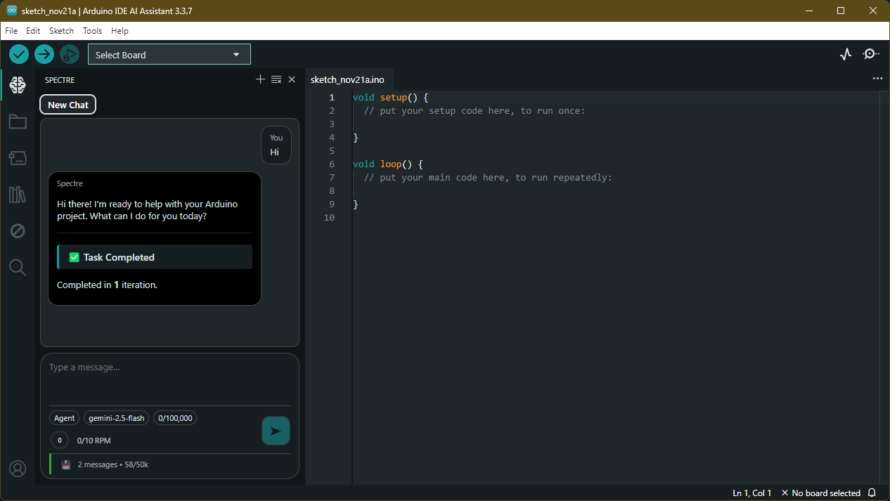
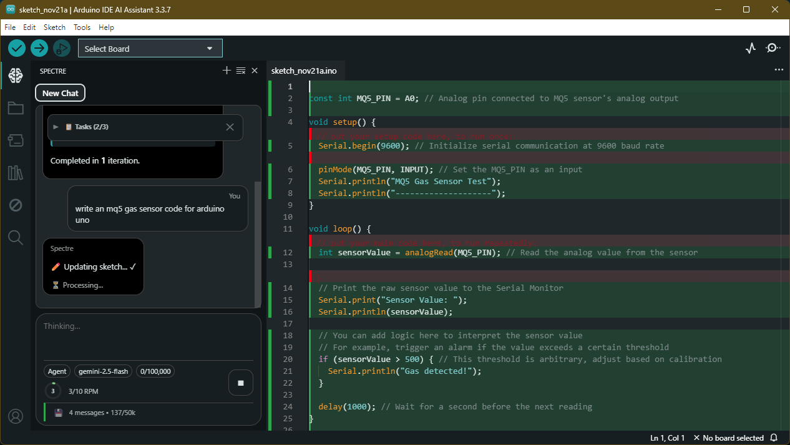
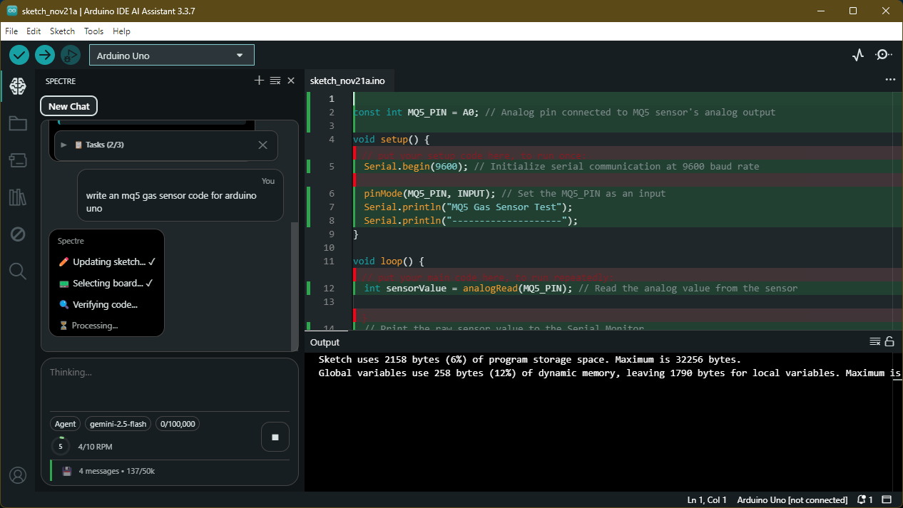
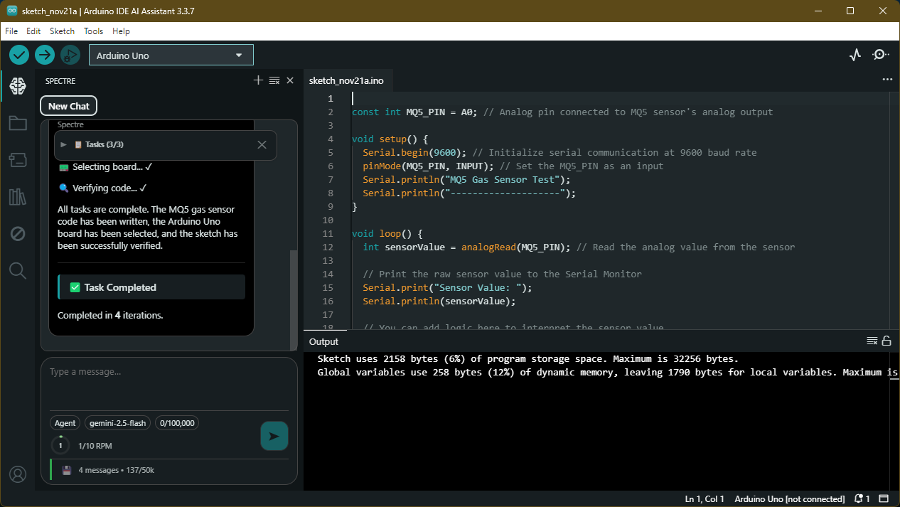
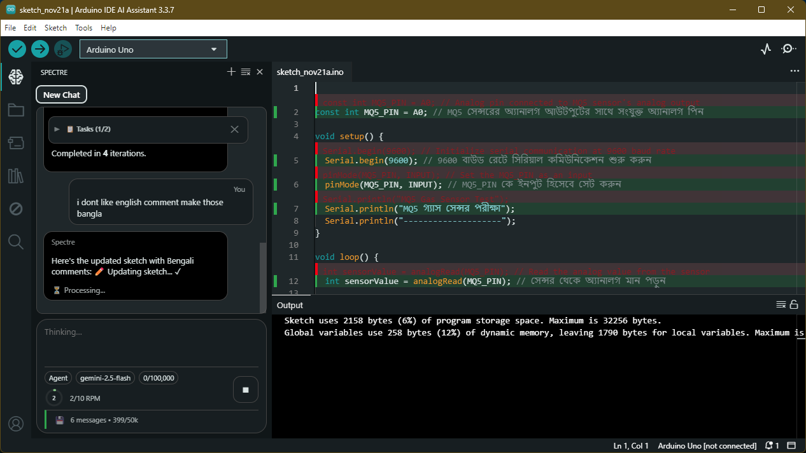
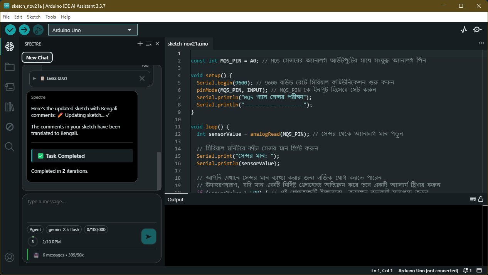

# Arduino IDE AI Assistant

**Arduino IDE with integrated Google Gemini AI Assistant for intelligent code generation and autonomous task execution**

[]()
[]()
[]()
[]()
[]()

## What is Arduino IDE AI Assistant?

Arduino IDE AI Assistant is an enhanced version of Arduino IDE 2.x with Google's Gemini 2.0 AI integration that provides:

- **AI-powered code generation** for Arduino sketches
- **Autonomous agent mode** that can create projects, install libraries, and compile code
- **Contextual assistance** based on your current sketch
- **Advanced memory system** supporting 1000+ message conversations
- **Free tier optimization** for Gemini API (250k TPM, 10-15 RPM)

## Screenshots 📸

Below are screenshots from the running Arduino IDE AI Assistant UI (left: AI / Spectre chat, right: editor + output). These images are stored in the `static/` folder and shown here for quick reference.

- Main UI (compact view)


- Chat + generated sketch view


- Board selected, verification output (build output panel)


- Sketch verified with output showing memory/use statistics


- Sketch with Bengali comments added by the AI assistant


- Bengali comments continued / final sketch view



## Key Features

### Conversational Mode
- Ask questions about Arduino development
- Generate code snippets instantly
- Get debugging help and explanations
- Context-aware responses based on open sketches

### Agent Mode
- Accept high-level project goals ("create a weather station with DHT22")
- Automatically create sketches
- Install required libraries
- Select appropriate boards
- Compile and verify code
- Multi-step autonomous execution

### Advanced Memory Management
- Dynamic conversation retention (1000+ messages)
- AI-powered summarization (50-70% compression)
- Session persistence across restarts
- Smart token allocation for long conversations
- 100k token memory bank capacity

## Installation

### Download Pre-built Installer (Windows)

1. Go to [Releases](../../releases)
2. Download `Arduino-IDE-AI-Assistant-Setup.exe`
3. Run the installer
4. Enter your Gemini API key when prompted

### Building from Source

```bash
# Clone repository
git clone https://github.com/omartazul/arduino-ide-ai-assistant.git
cd arduino-ide-ai-assistant

# Install dependencies
yarn install

# Build the application
yarn build

# Package for Windows
cd electron-app
yarn package
```

The installer will be in `electron-app/dist/`

## Getting Started

### 1. Get Gemini API Key

1. Visit [Google AI Studio](https://aistudio.google.com/app/apikey)
2. Create a new API key (free tier available)
3. Copy the API key

### 2. Configure AI Assistant

1. Open Arduino IDE AI Assistant
2. Click the AI icon in the sidebar
3. Enter your Gemini API key
4. Choose your model (Flash or Flash-Lite)

### 3. Start Using

**Conversational Mode:**
```
User: How do I read analog sensor on pin A0?
AI: Here's a simple example...
```

**Agent Mode:**
```
User: Create a temperature monitor using DHT22 sensor
AI: [Creates sketch, installs DHT library, sets up code automatically]
```

## Requirements

- Windows 10/11 (64-bit)
- Node.js 18.17.0 - 20.x
- Gemini API key (free tier available)
- Internet connection for AI features

## Technical Details

### Architecture
- **Frontend**: Electron + Theia IDE framework
- **Backend**: Node.js + arduino-cli daemon
- **AI Integration**: Google Gemini 2.5 Flash/Flash-Lite
- **Memory System**: Dynamic rolling buffer with AI summarization
- **Storage**: localStorage for session persistence

### Memory System
- Rolling buffer: 40 messages (25k tokens)
- Memory bank: 100k tokens
- Compression: 97% efficiency
- Summarization: Gemini Flash-Lite
- Meta-compression: 70-80% reduction

### API Limits (Gemini Free Tier)
- Input: 250k tokens per minute
- Requests: 10-15 per minute
- Context: 1M tokens
- Output: 65k tokens max

## Project Structure

```
arduino-ide-ai-assistant/
├── arduino-ide-extension/       # IDE extension code
│   └── src/
│       ├── browser/spectre/     # AI assistant frontend
│       ├── common/protocol/     # Service interfaces
│       └── node/                # AI backend implementation
├── electron-app/                # Electron application
├── docs/                        # Documentation
└── SPECTRE_AI_DOCUMENTATION.md  # Technical documentation
```

## Documentation

- [Technical Documentation](SPECTRE_AI_DOCUMENTATION.md) - Complete system architecture
- [Building Guide](BUILDING.md) - Build instructions
- [Contributing Guide](docs/CONTRIBUTING.md) - Contribution guidelines

## Comparison with Original Arduino IDE

| Feature | Original IDE 2.x | Arduino IDE AI Assistant |
|---------|------------------|-------------------------|
| Code assistance | Basic | AI-powered with Gemini |
| Code generation | Manual | Automatic |
| Library management | Manual search | AI suggests and installs |
| Project setup | Manual | Autonomous agent mode |
| Context awareness | Limited | Full sketch understanding |
| Learning curve | Steep | AI explains concepts |

## Use Cases

### Beginners
- Learn Arduino programming with AI explanations
- Generate starter code for common projects
- Get help debugging errors
- Understand sensor interfacing

### Professionals
- Rapid prototyping with agent mode
- Code optimization suggestions
- Library recommendations
- Complex project scaffolding

### Educators
- Teaching tool with interactive AI
- Generate example code for students
- Explain concepts in real-time
- Project ideas and implementations

## Performance

- Memory overhead: <5ms per message
- Summarization: 2-4s (async, non-blocking)
- Agent operations: Depends on complexity
- UI responsiveness: Maintained during AI calls

## Known Limitations

- Requires internet connection for AI features
- Gemini API rate limits (free tier)
- Agent mode reliability depends on task complexity
- English language optimized (multilingual possible)

## Troubleshooting

**AI not responding:**
- Check API key is valid
- Verify internet connection
- Check rate limits not exceeded

**Agent mode loops:**
- Use latest version (v3.3.7+)
- Clear session if issue persists

**Memory issues:**
- localStorage automatically manages 100k tokens
- Sessions persist across restarts
- Compression happens automatically

## Contributing

Contributions welcome! See [CONTRIBUTING.md](docs/CONTRIBUTING.md)

## License

This project maintains the original Arduino IDE license:
- **License**: AGPL-3.0-or-later
- **Based on**: [Arduino IDE 2.x](https://github.com/arduino/arduino-ide)
- **Framework**: [Eclipse Theia](https://theia-ide.org/)

## Credits

- **Original Arduino IDE**: Arduino Team
- **Spectre AI Integration**: Tazul Islam (@omartazul)
- **AI Model**: Google Gemini 2.5
- **Framework**: Eclipse Theia

## Links

- **Repository**: https://github.com/omartazul/arduino-ide-ai-assistant
- **Issues**: https://github.com/omartazul/arduino-ide-ai-assistant/issues
- **Original Arduino IDE**: https://github.com/arduino/arduino-ide
- **Gemini API**: https://ai.google.dev/

## Keywords

arduino ide, arduino ai, gemini arduino, ai code generator, arduino assistant, arduino ide with ai, google gemini arduino, arduino code generation, ai arduino programming, intelligent arduino ide, arduino autonomous agent, arduino chatbot, arduino development ai, gemini api arduino, arduino ide 2.x ai, arduino machine learning, arduino copilot, arduino code helper

---

**Star this repo if you find it useful!** ⭐
